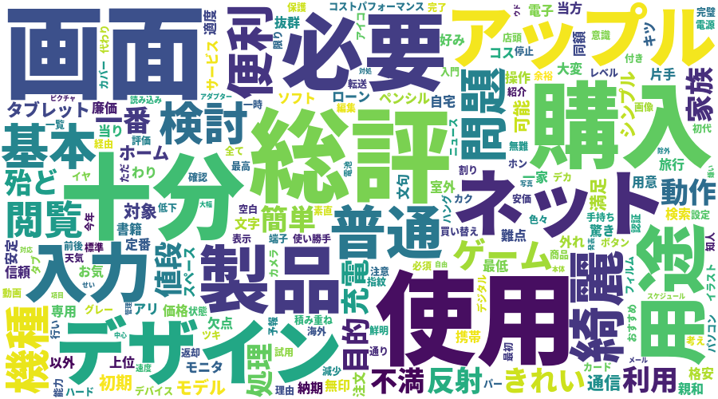

<h1>価格.comレビューコメントWordCloud</h1>

<h2>概要</h2>

価格.comのレビューコメントのページからレビューコメントを抽出してワードクラウドを生成します。 
各レビューコメントにおいて、単語が複数回登場してもカウント回数は1回としています。 
収集したデータについての取り扱いには改善点は多くあります。 
 

<a href="https://review.kakaku.com/review/K0001315600/#tab">パソコンのレビューコメント</a>のサンプル画像

<a href="https://review.kakaku.com/review/J0000033836/#tab">iPadのレビューコメント</a>のサンプル画像

<h2>使用方法</h2>

源暎ゴシックNというフォントを使用しているので、フォントについてはプログラム内の fontpath を変更してください。
<pre><code>> python analyzer.py
価格.comの商品レビューのリンクを貼ってください。
レビューコメントについてワードクラウドを生成します。
商品レビューリンク：https://review.kakaku.com/review/〇〇
</code></pre>

<h2>改善要素</h2>

形容詞、動詞についても扱うことを試みたが、ストップワード処理以外にもTF-IDFやその他方法で除去する必要がある語が多く存在した。 
形容詞、動詞についても扱えるようにするため、形態素解析結果の基本形での単語の収集は行っている。 
Word2Vecで判定される類似語についても扱えば、ある程度の似たような単語の扱いを同一にできるかもしれない。

<h2>使用技術など</h2>

<li>Python3</li>
<li>BeautifulSoup</li>
<li>MeCab</li>
<li><s>Word2Vec</s></li>
<li>フォント：<a href="https://okoneya.jp/font/download.html">源暎ゴシックN\GenEiGothicN-Heavy.otf</a></li>
